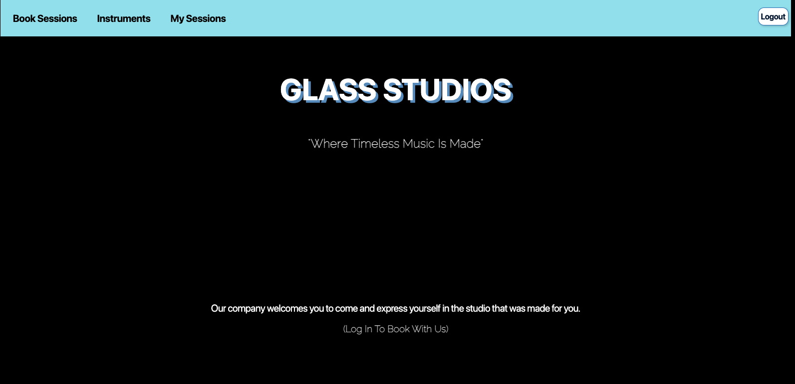

# Glass Studios: "Where Timeless Music Is Made"

Glass Studios is a home away from home. We provide our clientele with state of the art equipment and most importantly the atmosphere needed to create. Our company welcomes you to come and express yourself in a studio that was made for you.

Description: Glass Studios is a user friendly full stack web application created to track studio sessions. 

# Getting Started:
Click this link to explore & hopefully one day book with us: https://ea-studio-session-tracker.fly.dev

Planning Materials for Glass Studios: https://trello.com/invite/b/n8JZzk3j/ATTI1489ecd391753395019e42813f1b813d34E25566/studio-session-tracker-1

## Attributions: 
 * https://icons8.com/
 * https://fonts.google.com/

 Technologies Used:
 * JavaScript
 * HTML
 * CSS
 * MongoDB
 * Mongoose
 * Express JS
 * Google OAuth
 * Fly.io

 ## Future Plans For Glass Studios:
 * Implement a view that has the prices for each session package.
 * Implement a view that showcases photographs of the rooms in the studio.
 * Add a log in button that matches the log out button. 
 * Add a view that shows the contact information and directions.
 * Scale the app to be able to be viewed on mobile devices.
 * Add a calendar to show what days and times are avaiable for booking.

